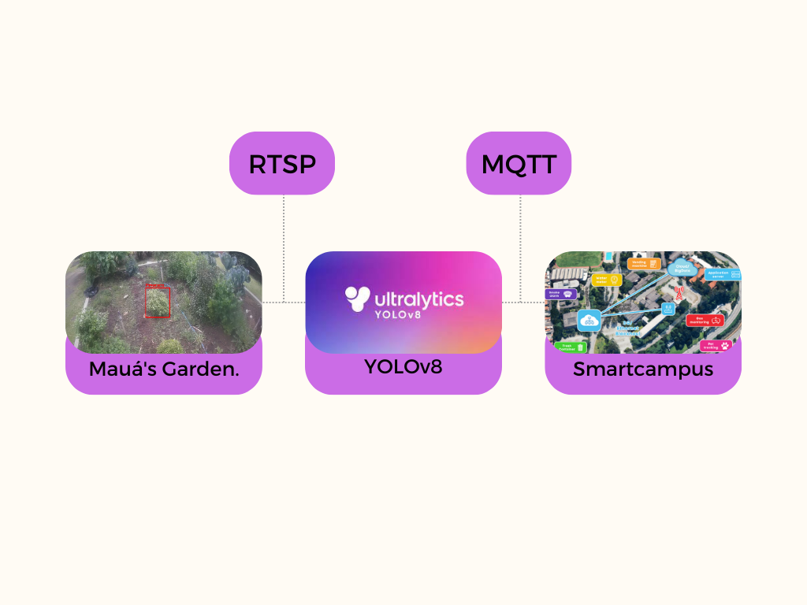

# Mesure-Plant-IC
Utilizing YOLOv8 for University Plant Height Progression

This project was undertaken in 2023 for my scientific initiation at the Mauá Institute of Technology. Its purpose is to measure the pepper plants in my college's garden and display the data on the smart campus dashboard of the university.

To collect the images, it is necessary to be connected to the college's Wi-Fi. The part related to updating the dashboard is incomplete because the MQTT has not been properly implemented. However, the training with YOLO and the identification of images from the college are functioning correctly.

[Baixe o Artigo Completo (PDF)](Assets/Cabral-Martins.pdf)
